# Prerequisites

You'll need to have the following installed:

* The latest .NET Core SDK (v2.1.101), available from [Microsoft](https://www.microsoft.com/net/download/windows)
* The latest VS Code, available from [Microsoft](https://code.visualstudio.com/download)
* The Omnisharp C# Extension :

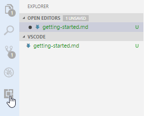
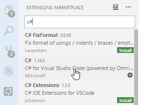
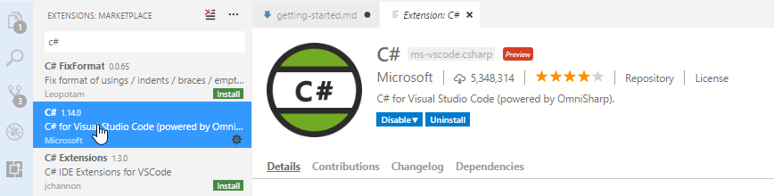

## Setting up project structures

Create a folder on your disk somewhere that's going to be where your code will live (I'm using `c:\projects\net-training\VSCode`)

From the file menu select "Open Folder..." and select the path you created. VSCode will now show you an empty tree on the left hand side in the explorer.

We're going to use the .NET Core Command line interface (CLI) tools to create our projects and add references between them (you can find documentation about them at [Microsoft](https://docs.microsoft.com/en-us/dotnet/core/tools/?tabs=netcore2x))

Open the integrated terminal inside VS Code (keyboard shortcut is Ctrl + ')

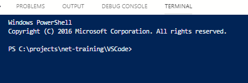

Enter the following `dotnet new classlib -n Library`

This will create you a new class library project called Library in a folder called `Library` - you'll see that a new entry has been created in the explorer view on the left - which when you expand should look like the following:

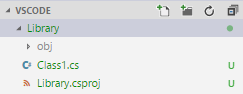

Now enter the following:

* `dotnet new xunit -n UnitTests` to create a xUnit based unit test library called `UnitTests`
* `dotnet new console -n ConsoleApp` to create a console app called `ConsoleApp`

You'll now have three projects that look like the following:

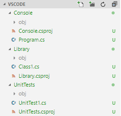

We're now going to create references between the projects. We're going to point the UnitTests at Library, and then the ConsoleApp at Library:

* `dotnet add UnitTests\UnitTests.csproj reference Library\Library.csproj`
* `dotnet add ConsoleApp\ConsoleApp.csproj reference Library\Library.csproj`

Finally we're going to add a solution file and then add each project to it:

* `dotnet new sln -n VSCode` to create the solution file (VSCode.sln)
* `dotnet sln VSCode.sln add ConsoleApp\ConsoleApp.csproj` to add the Console project
* `dotnet sln VSCode.sln add Library\Library.csproj` to add the Library project
* `dotnet sln VSCode.sln add UnitTests\UnitTests.csproj` to add the UnitTest project

You'll now have a solution file (VSCode.sln) that has contents similar to:

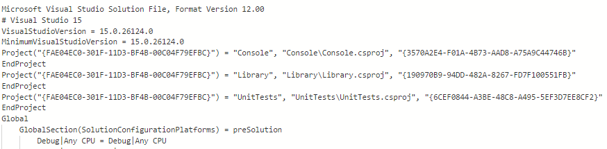

### BUILDING!

Now that we've got the structure in place we can actually build it!

Enter the command `dotnet build` and you should get an output like:

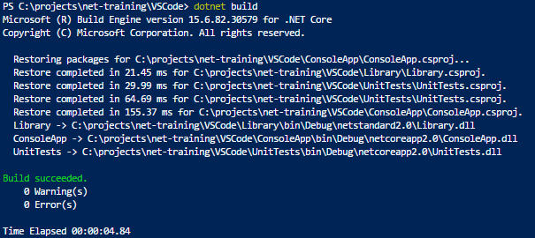

We can also now run our console app - which does nothing except the obligatory "Hello World" - we run it using the dotnet command again : 

* `dotnet run --project ConsoleApp\ConsoleApp.csproj`

Which should give you an output that looks like:

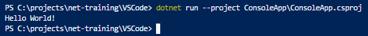

### TESTING!

Since we created a unit test project we can prove that the boiler plate test in there executes using the command: 

* `dotnet test UnitTests\UnitTests.csproj`

When run you should get the following output:

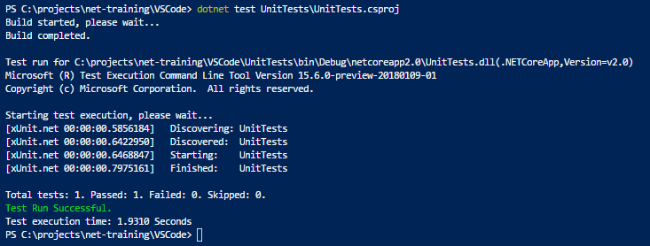

You can see that a single test was executed - AND PASSED! Because it does nothing... there will be proper tests soon!

## Proper code and stuff

We're going to add some meat to our projects bones - we'll start with a simple static type that executes "is this string a palindrome?".

In the Library project - open the file called Class1.cs and paste the following in:

```C#
using System;

namespace Library
{
    public static class Palindromes
    {
        public static bool IsPalindrome(string palindrome)
        {
            throw new NotImplementedException("This hasn't been built yet!");
        }
    }
}
```

Rename the file `Class1.cs` to `Palindromes.cs`

This is the method we're going to plug into - note there's no implementation - that's what you're going to fill in soon.

Now we'll add some tests - in the UnitTests project open the file `UnitTest1.cs` and paste in the following:

```C#
using FluentAssertions;
using Library;
using Xunit;

namespace UnitTests
{
    public class PalindromeTests
    {
        [Theory]
        [InlineData("radar", true)]
        [InlineData("anna", true)]
        [InlineData("Civic", true)]
        [InlineData("DEVOVED", true)]
        [InlineData("Aibohphobia", true)]
        [InlineData("lard", false)]
        [InlineData("Palindrome", false)]
        [InlineData("", false)]
        [InlineData(null, false)]
        public void IsSimplePalindrome(string text, bool isPalindrome)
        {
            Palindromes.IsPalindrome(text).Should().Be(isPalindrome);
        }

        [Theory]
        [InlineData("Do nine men interpret? Nine men. I nod.", true)]
        [InlineData("A dog! A panic in a pagoda!", true)]
        [InlineData("A Toyota! Race fast, safe car! A Toyota!", true)]
        [InlineData("Are we not pure? \"No sir!\" Panama’s moody Noriega brags. \"It is garbage!\" Irony dooms a man; a prisoner up to new era.", true)]
        [InlineData("Not a palindrome", false)]
        public void IsAdvancedPalindrome(string text, bool isPalindrome)
        {
            Palindromes.IsPalindrome(text).Should().Be(isPalindrome);
        }
    }
}
```

Also rename the file to `PalindromeTests.cs`

Before we can build and run these tests we need to add a NuGet package for FluentAssertions, run the following command : 

* `dotnet add Library\Library.csproj package FluentAssertions`. 

Once that's completed you'll need to run another command: 

* `dotnet restore` 

to make sure everything's lined up.

You'll now be able to run the tests and watch as they FAIL:

* `dotnet test UnitTests\UnitTests.csproj`

Your output will be a WALL of red text finishing with the following:

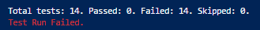

OH NOES!

## YOUR MISSSION

Should you choose to accept it - is to write code in the Palindromes type that passes all 14 tests. You are free to use whatever techniques / approach you wish. Remember that online documentation / Stack Overflow are your friends - if you know you want to do something, but don't know how - it's OK to Google it. I do, everyone else does.

# Stretch goals

Some extra scenarios are available:

## Largest Integer

Add a new file to UnitTests called `LargestIntegerTests.cs` - paste the following code in 

```C#
using FluentAssertions;
using Library;
using Xunit;

namespace UnitTests
{
    public class LargestIntegerTests
    {
        [Theory]
        [InlineData(new int[] { 1, 2, 3, 4 }, 4)]
        [InlineData(new int[] { 100, 1000, 2000, 5 }, 2000)]
        [InlineData(new int[] { 100000, 1000, 2000, 5 }, 100000)]
        [InlineData(new int[] { 1000, 1000, 1000, 5 }, 1000)]
        public void CorrectValueIsSelectedFromArray(int[] array, int expectedMax)
        {
            LargestInteger.FindLargest(array).Should().Be(expectedMax);
        }
    }
}
```

Then add a file called `LargestInteger.cs` to Library and paste in the following code:

```C#
using System;
using System.Collections.Generic;

namespace Library
{
    public static class LargestInteger
    {
        public static int FindLargest(IEnumerable<int> integers)
        {
            throw new NotImplementedException("This hasn't been built yet!");
        }
    }
}
```

## Leap Years

Add a file called `LeapYearTests.cs` to the UnitTests project with the following content:

```C#
using FluentAssertions;
using Library;
using Xunit;

namespace UnitTests
{
    public class LeapYearTests
    {
        [Theory]
        [InlineData(1997)]
        [InlineData(1901)]
        [InlineData(1933)]
        public void NonDivisibleByFourReturnsFalse(int year)
        {
            LeapYears.IsLeapYear(year).Should().Be(false);
        }

        [Theory]
        [InlineData(1996)]
        [InlineData(2004)]
        [InlineData(2020)]
        public void DivisibleByFourAndNotByOneHundredReturnsTrue(int year)
        {
            LeapYears.IsLeapYear(year).Should().Be(true);
        }

        [Theory]
        [InlineData(1700)]
        [InlineData(1800)]
        [InlineData(1900)]
        public void DivisibleByFourAndByOneHundredButNotByFourHundredReturnsFalse(int year)
        {
            LeapYears.IsLeapYear(year).Should().Be(false);
        }

        [Theory]
        [InlineData(1600)]
        [InlineData(2000)]
        public void DivisibleByFourAndByOneHundredAndByFourHundredReturnsTrue(int year)
        {
            LeapYears.IsLeapYear(year).Should().Be(true);
        }
    }
}
```

Then add a file called `LeapYears.cs` to Library and paste the following:

```C#
using System;
using System.Collections.Generic;

namespace Library
{
    public static class LeapYears
    {
        public static bool IsLeapYear(int year)
        {
            throw new NotImplementedException("This hasn't been built yet!");
        }
    }
}
```